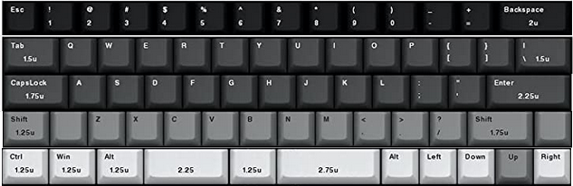
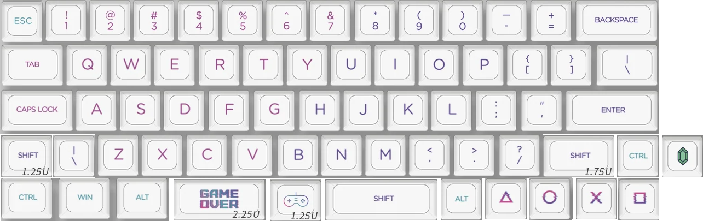

# KBDKID2

## Info
This is my second attempt at a keyboard. This time I will learn from the mistakes of the old one
and attempt to make a low profile, using Kailh Choc V2 switches (god help me). It will require
a custom PCB, (maybe?) custom plate, and the stab situation is probably horrible..

It is heavily based off of the GH60 board which has been rehacked into eg. the DZ60 (which the
kbdkid1 is based off of). Doing so assures that all the measurements, placement of screws, etc.
all are the same so that we can use off the shelf components such as plates, stabs and cases.

PCB can be found [here](https://github.com/Tubbles/kbdkid2-pcb).

Note that normal keycaps does not fit on these switches, they bottom out too low, so we need
to go with eg. XDA, DSA, or similar "lower" caps.

* Caps lock is bound to the mouse layer (hyper layer)
* Tip: Open the json file in qmk online configurator
* Find out how to make it wireless?

### Second to bottom row from left to right
| 1.25x  | 1x    | 10 x 1x     | 1.75x  | 1x    |
| ------ | ----- | ----------- | ------ | ----- |
| lshift | lpipe | normal keys | rshift | rctrl |

### Bottom row from left to right
| 1.25x | 1.25x  | 1.25x | 2.25x | 1.25x | 2.75x | 1x    | 1x   | 1x   | 1x  | 1x    |
| ----- | ------ | ----- | ----- | ----- | ----- | ----- | ---- | ---- | --- | ----- |
| lctrl | lsuper | lmeta | lower | space | upper | rmeta | left | down | up  | right |

### Number of keycaps required
| Size[U] | Amount | Keys                                        |
| ------- | ------ | ------------------------------------------- |
| 1x      | 53     | norms, left, down, up, right                |
| 1.25x   | 5      | lctrl, lsuper, lmeta, lshift, space         |
| 1.5x    | 2      | tab, rpipe                                  |
| 1.75x   | 2      | rshift, caps lock (lhyper, aka mouse layer) |
| 2x      | 1      | backspace                                   |
| 2.25x   | 2      | enter, lower                                |
| 2.75x   | 1      | upper                                       |

Total number of keys: 66

## Example populated

## BOM
### Case
*

### PCB
* Custom (hot swap?) 60% USB-C

### Plate
*

### Switch
* Kailh Choc V2 Red https://kono.store/collections/switches/products/kailh-choc-mx-switches

### Stabs
*

### Keycaps
* NP Electronic Game Keycaps Set https://kbdfans.com/collections/np-pg-da-profile/products/np-game-keycaps-set

### Accessories
* Lube
